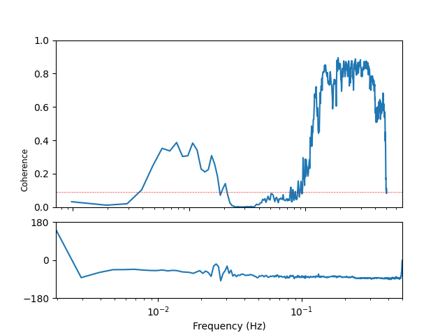
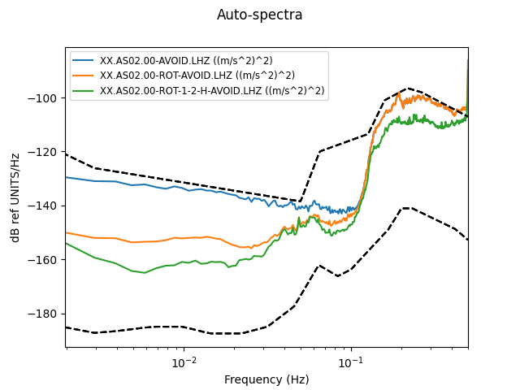
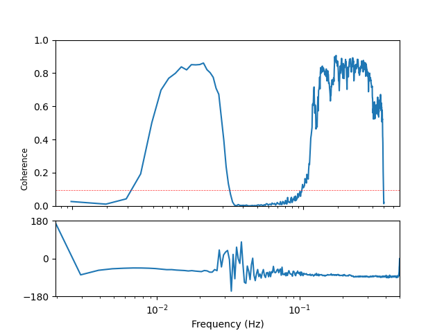
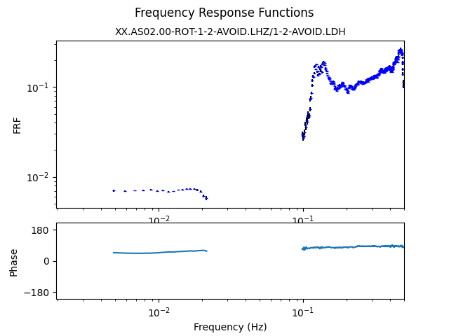

# NOISE REDUCTION CHALLENGE: REAL DATA

8 days of data, sampled at 1 sps, from near the RAINBOW hydrothermal field.
Lots of earthquakes and a relatively weak infragravity wave signal.
Data, our processing codes (using [tiskitpy](https://github.com/WayneCrawford/tiskitpy)) and results are [here](CHALLENGE/RAINBOW_files/README.md).

## Original data

[run_obspy.py](../RAINBOW_files/run_obspy.py)

### Waveforms

### Probabilistic Power Spectral Densities

### Compliance

## After rotation and transfer function noise removal

[run_tiskitpy.py](../RAINBOW_files/run_tiskitpy.py)

### Waveforms

### Z-channel Power Spectral Densities compared

### Pressure-acceleration coherence of cleaned data

### Compliance of cleaned data (amplitude problem, probably using COUNTS)

## The above, plus manually identifying and removing glitches and other anomalies

We get a better result if we manually identify glitches and other anomalous noise:

[run_tiskitpy.py](../RAINBOW_files/run_tiskitpy.py)

### Waveforms

## Z-channel Power spectral densities

## Pressure-acceleration coherence

## Compliance (amplitude problem, probably using COUNTS)

