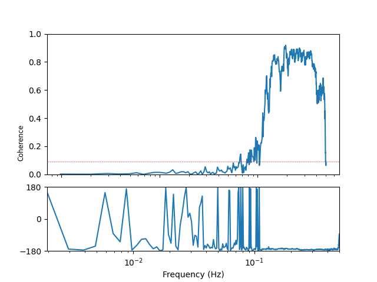
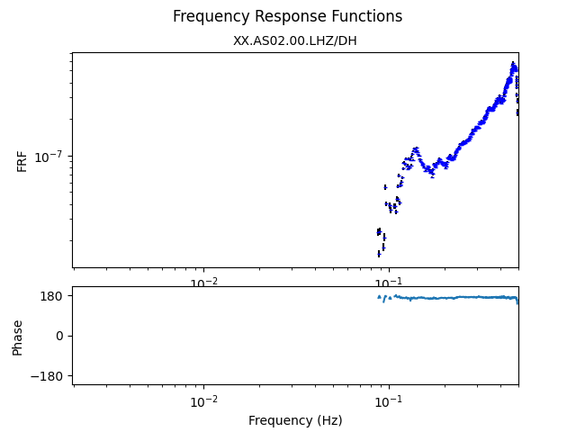
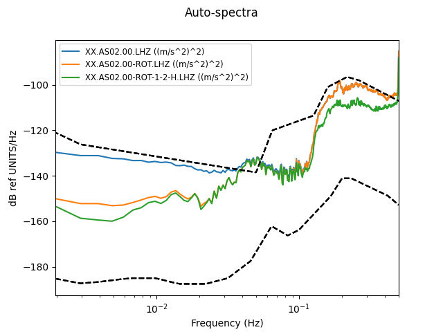
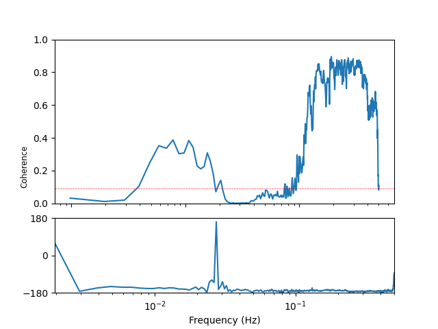
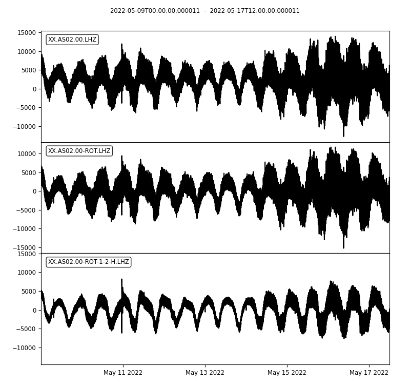
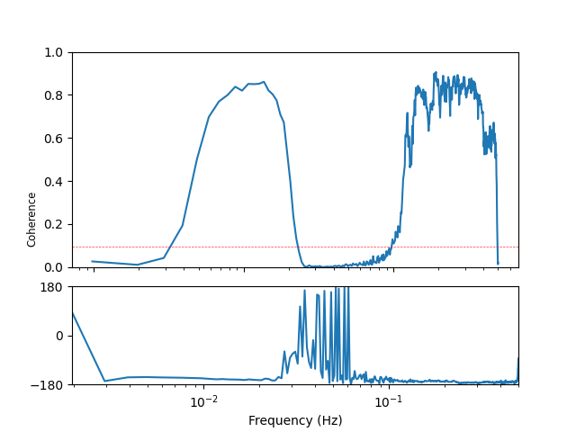

# NOISE REDUCTION CHALLENGE: REAL DATA

8 days of data, sampled at 1 sps, from near the RAINBOW hydrothermal field.
Lots of earthquakes and a relatively weak infragravity wave signal.
Data, our processing codes (using [tiskitpy](https://github.com/WayneCrawford/tiskitpy)) and results are [here](CHALLENGE/RAINBOW_files/README.md).

## Original data

Code used: [run_original.py](../RAINBOW_files/run_original.py)

### Waveforms

### Z Channel Probabilistic Power Spectral Density

### Z-H Coherence

### Z-H Transfer function

## After rotation and transfer function noise removal

Code used: [run_clean.py](../RAINBOW_files/run_clean.py)

### Z waveform comparison

### Z Power Spectral Density comparison

### Best Z-H Coherence

### Best Compliance

## Cleaned, plus removal of manually identified glitches and other anomalies

Code used: [run_tiskit_avoid.py](../RAINBOW_files/run_tiskit_avoid.py)

### Z waveform comparison

### Z Power Spectral Density comparison

### Best Z-H Coherence

### Best Compliance

