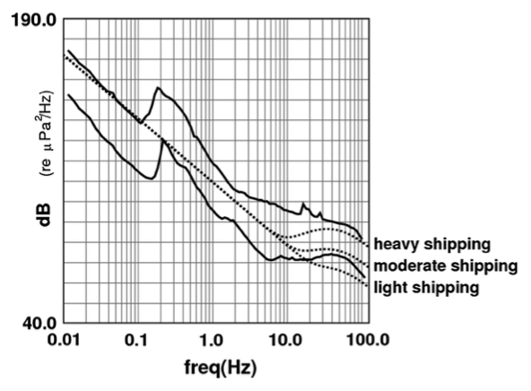

# WP2: Full Seafloor Spectrum

This WP consolidates the cross-WP tasks of dataset selection and validation, reducing work in each WP
and choosing datasets with more cross-WP interest. This WP will also quantify seismological noise levels
and compile a a full-spectrum vision of the results of WPs 3-5. 

[Work Package Management Site](WP2)

## Objectives

- Establish a catalogue of existing data (by oceans and world regions) and
  how to access them.
- Establish a catalogue of ocean bottom noise signals and their sources.
- Determine the seafloor pressure noise floor.

## Tasks

| Number | Title | Responsable | Status |
| ------ | ------ | ---------- | ------ |
| T2.1   | Dataset selection and validation | @WayneCrawford, Eleonore, Guilhem | not started |
| T2.2 | Pressure noise bounds | @WayneCrawford |  not started |
| T2.3  | Noise source catalog | @WayneCrawford, Kinda? | not started |

## Deliverables

| Number | Title | Due Date | Status |
| ------ | ------ | ---------- | ------ |
| D2.1  | Catalogue of available OBS data and characteristics | M12 | not started |
| D2.2 | Low and High noise reference levels for OBS  | M36 | not started |
| D2.3 | Seismological noise source catalog | M44 | not started |

## Possible OBS datasets

See [here](datasets.md)

## Details

### Task 2.1: Dataset identification and validation

- 2.1.1: Catalogue existing databases and their characteristics (access method, region, sensors, seasons...)
- 2.1.2: Evaluate the interest of each dataset according to the needs of WPs 3-5
- 2.1.3: Select data sets based on the above criteria
- 2.1.3: Validate data access and specify the access method for each selected data set

### Task 2.2: Pressure noise bounds

For the chosen data sets and other large or spatially isolated datasets, we will confirm instrument responses
and calculate Probabilistic Power Spectral Densities to determine upper and lower bounds of seafloor pressure signals.

This should be done in coordination with [EnvSeis ESR04](https://www.envseis.eu/projects/esr-04-noise-in-the-ocean-monitoring-anthropogenic-pollution-and-natural-noise-in-the-sea) and in comparison with the noise bounds provided in [Brown et al. 2014](https://doi.org//10.1007/s00024-012-0573-6) (figure below)

### Task 2.3: Seismological noise source catalog
Combining the noise sources identified by WPs 3-5 with other sources in the scientific literature.
