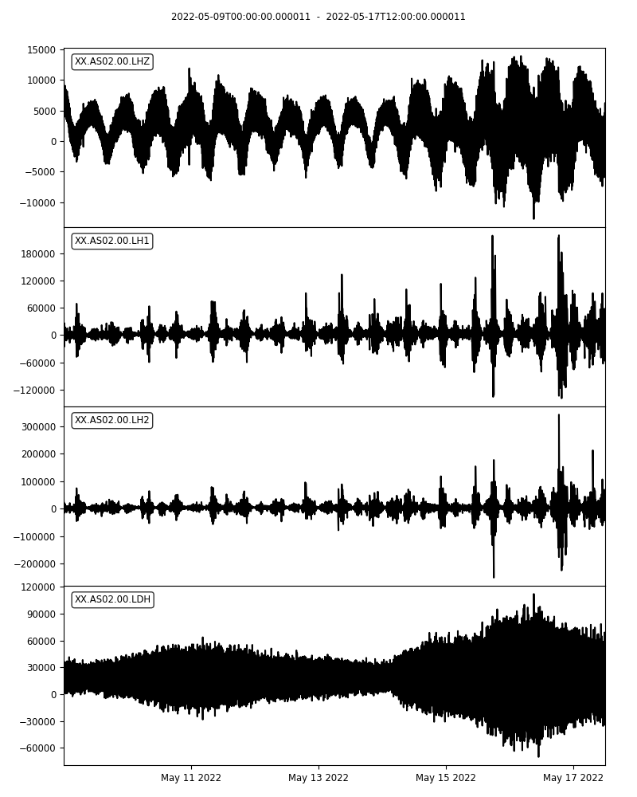
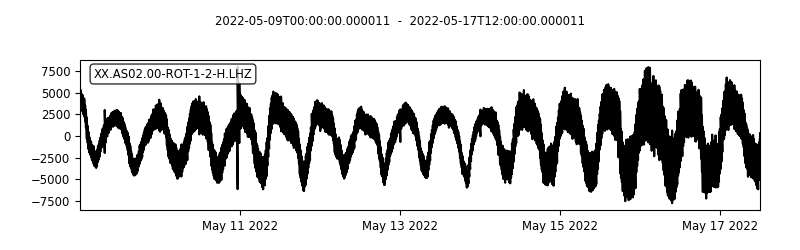
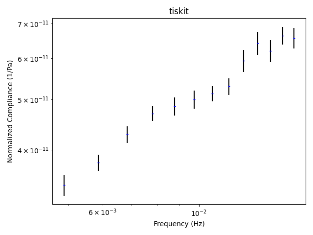
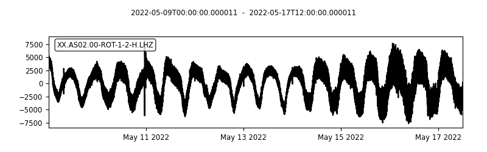
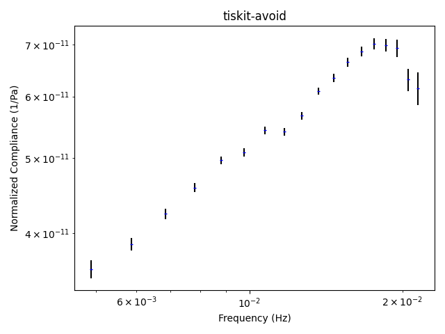

# The Noise Reduction Challenge

We propose two datasets as a challenge to all researchers to

1) minimize non-seismological noise;
2) calculate the seafloor compliance (seafloor motion divided by pressure as a function of frequency).

The first dataset is seafloor data recorded on the Mid-Atlantic Ridge.  The second is synthetic, based on models of infragravity wave energy, instrument noise and seafloor tilt. We also provide examples of processing the first dataset, using the [tiskitpy](https://tiskitpy.readthedocs.io) package.

All researchers are invited to process these data and send us their results.
All participants will be invited to be co-authors of a community paper comparing the different methods and results.

## Downloads

- [The first dataset](CHALLENGE/REAL.zip)
- [The synthetic dataset](CHALLENGE/SYNTHETIC.zip)
- [Examples of processing the first dataset](CHALLENGE/EXAMPLE.zip).
- [2024 AGU Poster](CHALLENGE/Crawford_BRUIT-FM_challenge_v5.pdf)

# Datasets

## ARC-EN-SUB station

8 days of data, sampled at 1 sps, from near the RAINBOW hydrothermal field.  Lots of earthquakes and a relatively weak infragravity
wave signal.  Data, our processing codes (using [tiskitpy](https://github.com/WayneCrawford/tiskitpy) and results are [here](CHALLENGE/RAINBOW_files/README.md).

Here are plots of the data and our results:  can you do better?


### Original data

[run_original.py](CHALLENGE/RAINBOW_files/run_original.py)

#### Waveforms



#### Compliance

*Not enough coherence to calculate compliance*


### After rotation and transfer function noise removal

[run_tiskit.py](CHALLENGE/RAINBOW_files/run_tiskit.py)

#### Z Waveform



#### Compliance




#### Manual select time spans to avoid

We get a better result if we manually identify glitches and other anomalous noise to avoid:

[run_tiskit_avoid.py](CHALLENGE/RAINBOW_files/run_tiskit_avoid.py)

##### Z Waveform



##### Compliance

Compliance gets to higher frequencies, but is probably too low at the highest frequencies (not accounting for noise on pressure channel)




### More details available [here](CHALLENGE/RAINBOW_details/README.md)

## Synthetic data

Coming!

# Data and submission formats

Data channels are:

- LDG: Pressure
- LHZ: Vertical motion
- LHN: Horizontal motion, N-S direction
- LHE: Hotizontal motion, E-W direction

*Data on this site are in compressed miniSEED format.  If you don't use miniSEED, you can extract to another format using obspy's [stream.read()](https://docs.obspy.org/packages/autogen/obspy.core.stream.read.html#obspy.core.stream.read) and [stream.write()](https://docs.obspy.org/packages/autogen/obspy.core.stream.Stream.write.html#obspy.core.stream.Stream.write) functions,  or write to
[bruit-fm-challenge@services.cnrs.fr](mailto:bruit-fm-challenge@services.cnrs.fr?subject=Noise%20Challenge%20Request) and we'll send you the data in ASCII format.*

Metadata are in StationXML format.  You don't have to use them if you don't want to.

Results should be sent to [bruit-fm-challenge@services.cnrs.fr](mailto:bruit-fm-challenge@services.cnrs.fr?subject=Noise%20Challenge%20Submission) with the following files (``{name}`` is some identifying name, such as your last name or the software package you used):

- ``{name}_TS.mseed`` or ``{name}_TS.csv``: Cleaned time series in miniSEED or ASCII format

    - should have the same channel names as the original data files
    - if CSV, use the same time range as the input file, ';' as the separator, '.' as the decimal point, and the following header line:
      ```
      LDH;LH1;LH2;LHZ
      ```
- ``{name}_compliance_{units}.csv``: Calculated compliance as a CSV file:

    - Compliance is the vertical motion over the pressure at frequencies < 0.05 Hz.  It may be different from PSD(LHZ)/PSD(LDG), depending on the
      noise distribution.
    - Where ``{units}`` are "Pa-1", "MperPa", "MperS_Pa", "MperS2_P", "COUNTSperCOUNT" (use this last if you did not use the metadata file)
    - Columns should be frequency (Hz); compliance ({units}); uncertainty ({units)); phase between LHZ and LDG channels (degrees)
    - First line should be ``frequencies;compliance;uncertainty;phase``

- ``{name}_codes.zip``: Zipped file with all of the codes you used
- ``{name}_explanation.txt``: Text file with any explanation you want to give, plus your name and email address.
  If your code uses packages that need to be downloaded, explain how to download them.
  If it uses code that you do not wish to make available, state so.
