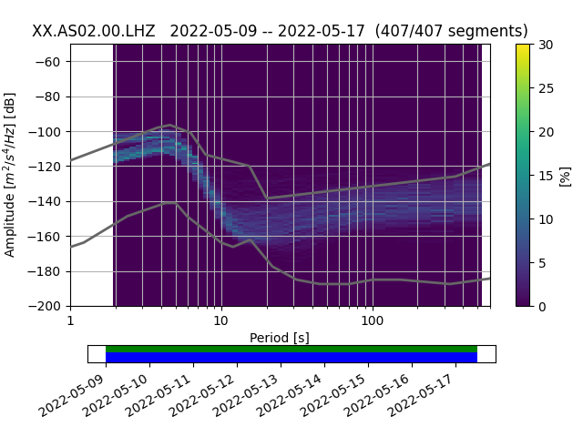
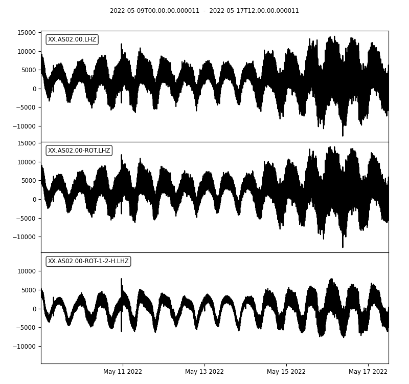
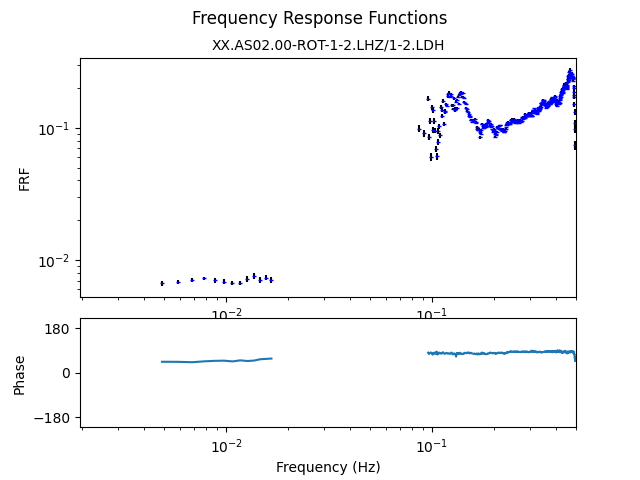

# The Noise Reduction Challenge

We will propose two datasets as a challenge to all researchers to 1) minimize non-seismological noise and
2) calculate the seafloor compliance (seafloor motion divided by pressure as a function of frequency).  The first dataset consists
of true seafloor data recorded on the Mid-Atlantic Ridge, the second of synthetic data.  For the first dataset, we will show our
processing and calculated results.  The second is a blind test.

All researchers are invited to process these data and send us their results.  All participants will be invited to be co-authors of a
community paper comparing the different methods and results.

## The datasets

### ARC-EN-SUB station 8

8 days of data, sampled at 1 sps, from near the RAINBOW hydrothermal field.  Lots of earthquakes and a relatively weak infragravity
wave signal make this a hefty challenge.  Data, our processing codes (using [tiskitpy](https://github.com/WayneCrawford/tiskitpy)
and the [bruit-fm toolbox](https://gitlab.ifremer.fr/anr-bruitfm/bruit-fm-toolbox) and results are [here](RAINBOW_files).
Here are plots of the data and our results:  can you do better?

#### run_obspy.py

##### Waveform plot

##### Probabilistic Power Spectral Density

#### run_tiskitpy.py

##### Waveforms (original, rotated, and rotated + transfer function noise removal)

##### Power spectral densities of the above three waveforms

##### Pressure-acceleration coherence of cleaned data

##### Compliance of cleaned data (amplitude problem, probably using COUNTS)

#### Cheating!

We get a better result if we manually identify glitches and other anomalous noise:

##### Waveforms

##### Power spectral densities

##### Pressure-acceleration coherence

##### Compliance (amplitude problem, probably using COUNTS)

### Synthetic data

Coming!
