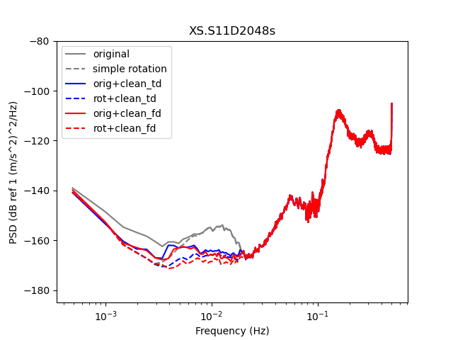
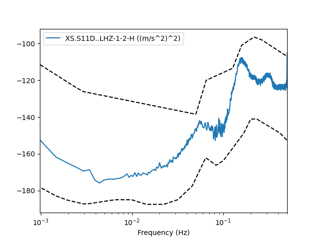

Here is an example of seafloor data and its cleaning using Wayne's codes

## Wayne's processing module
Wayne's code is called [tiskit](https://github.com/WayneCrawford/tiskit) and it's available online at github.  It uses [obspy](https://github.com/obspy/obspy/wiki/).  Please install `obspy` first following their installation instructions, then install `tiskit` within your `obspy` environment using the instructions on the `tiskit` webpage. I think that the `obspy` environment contains all of the moddules needed for `tiskit`, please tell me if this is not so.

There is a problem with tiskit, which makes it not reduce noise on the data stream as much as it should  (compare the top plot below, which is what tiskit is currently getting, to the bottom plot, which is what it should get.)

## Files to download

There is a data file, a metadata file and the python run script

- [Data File](Files/XS.S11D.LH.2016.12.11.mseed)
- [Metadata File](Files/stations_PILAB_S_decimated.xml)
- [Python Script](Files/run_data_cleaner.py)
- [Python TraceCompare class (used to compare PSDs)](Files/trace_compare.py)

## Images of results

- PSD of corrected stream: 

- Direct calculation of corrected PSD from input stream: 
