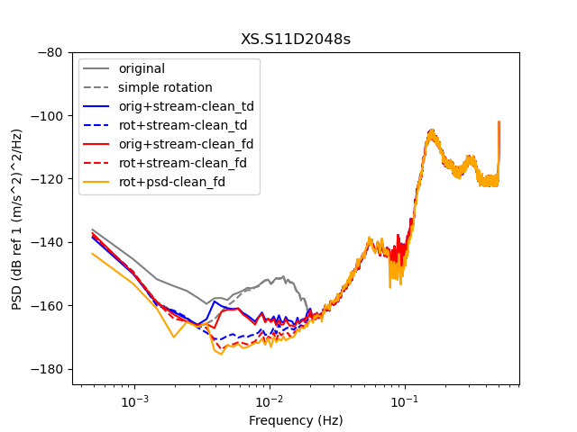

Here is an example of seafloor data and its cleaning using the python ``tiskitpy`` code

## tiskitpy

[tiskitpy](https://github.com/WayneCrawford/tiskitpy) is documented at [tiskitpy.readthedocs.io](https://tiskitpy.readthedocs.io), including how to install, examples and a complete
description of each component class.

## Installing

Installation instructions are found [in the documentation](https://tiskitpy.readthedocs.io/en/latest/install.html).  
If anything does not work for you, please tell Wayne or, better yet, leave an [issue](https://github.com/WayneCrawford/tiskitpy/issues).

## Files to download

The script requires tiskitpy 0.3 or higher

Run the script using `python3 run_data_cleaner.py`  When you run it for the first time, `CleanRotator` will download an earthquake
catalog to your directory.

- [run_data_cleaner.py](Files/run_data_cleaner.py)
- [Data File](Files/XS.S11D.LH.2016.12.11.mseed): contains one day of data from a seafloor broadband OBS
- [Metadata File](Files/stations_PILAB_S_decimated.xml): contains an inventory of the station and the channel responses.

## Images of results

`run_data_cleaner.py` should plot the orginal power spectral densities for the four channels, then the following image, which compares the PSDs obtained from:
- The original data
- The original data plus simple rotation (CleanRotator class)
- The original data, cleaned using the DataCleaner class and a *time*-domain stream-cleaning method
- The rotated data, cleaned using the DataCleaner class and a time-domain stream-cleaning method
- The original data, cleaned using the DataCleaner class and a *frequency*-domain stream-cleaning method
- The rotated data, cleaned using the DataCleaner class and a frequency-domain stream-cleaning method
- The rotated data, with the PSD calculated taking into account the DataCleaner

