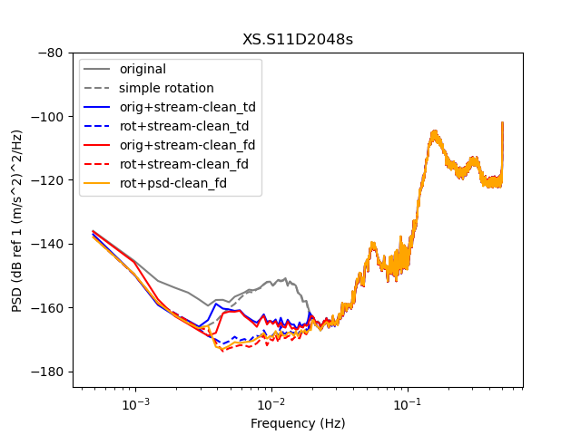

Here is an example of seafloor data and its cleaning using Wayne's codes

## Wayne's processing module
Wayne's code is called [tiskit](https://github.com/WayneCrawford/tiskit) and it's available online at github.  It uses [obspy](https://github.com/obspy/obspy/wiki/).  Please install `obspy` first following their installation instructions, then install `tiskit` within your `obspy` environment using the instructions on the `tiskit` webpage. I think that the `obspy` environment contains all of the moddules needed for `tiskit`, please tell me if this is not so.

There is a problem with tiskit, which makes it not reduce noise on the data stream as much as it should  (compare the top plot below, which is what tiskit is currently getting, to the bottom plot, which is what it should get.)

## Files to download

The script requires tiskit 0.2

Run the script using `python3 run_data_cleaner.py`  When you run it for the first time, the CleanRotator will download an earthquake
catalog to your directory.

- [run_data_cleaner.py](Files/run_data_cleaner.py)
- [Data File](Files/XS.S11D.LH.2016.12.11.mseed): contains one day of data from a seafloor broadband OBS
- [Metadata File](Files/stations_PILAB_S_decimated.xml): contains an inventory of the station and the channel responses.

## Images of results

`run_data_cleaner.py` should output the following image, which compares the PSDs obtained from:
- The original data
- The original data plus simple rotation (CleanRotator class)
- The original data, cleaned using the DataCleaner class and a *time*-domain stream-cleaning method
- The rotated data, cleaned using the DataCleaner class and a time-domain stream-cleaning method
- The original data, cleaned using the DataCleaner class and a *frequency*-domain stream-cleaning method
- The rotated data, cleaned using the DataCleaner class and a frequency-domain stream-cleaning method
- The rotated data, with the PSD calculated taking into account the DataCleaner

