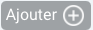

# BRUIT-FM

This is the point of entry for the BRUIT-FM project.  You will find links to descriptions of the project parts, as well as project management pages.  

## The Project

- [Overview](overview.md)
- [Members](members.md)
- [Meetings and Events](meetings-events.md)
- [Deliverables and Milestones](deliverables-milestones.md)
- [Datasets](datasets.md)
- [Budget](budget.md)
- [Administration](administration.md)
- Go to the [Project Management Site](https://resana.numerique.gouv.fr/public/perimetre/consulter/121414#)

## Announcements

There is a post-doctoral position available at IFREMER on [signal processing and data science applied to marine seismology](Documents/Ifremer_2022_Bruit-FM-Postdoc-Ocean-Bottom-Noise-Shazam.pdf) starting Spring/Summer 2022

## Work Packages

| Web Page         | Project Management |
| :--------------- | ---------- |
| [WP1: Coordination, Management and Animation](WP1.md)  | Page() |
| [WP2: Full Seafloor Spectrum](WP2.md)  | Page() |
| [WP3: The Generation of Global Seismological Noise](WP3.md)  | [Page](https://resana.numerique.gouv.fr/public/perimetre/consulter/132788) |
| [WP4: Seafloor Signal Separation and Noise Removal](WP4.md)  | [Page](https://resana.numerique.gouv.fr/public/perimetre/consulter/132795) |
| [WP5: Seafloor Soundscape](WP5.md)  | [Page](https://resana.numerique.gouv.fr/public/perimetre/consulter/121579) |

## Project Management pages
The project management pages are where you should put shared files, collaborate on documents/spreadsheets/presentations and send out news/updates to everyone or your work package.

We are using the French governments "RESANA" platform, once you are on the site, the tabs at the top let you:
- : see recently added items (news, documents, actions...)
- : look at, add and edit shared files
- : look at dates and deadlines in calendar format
- : Add/display action items.  You can view them under this tab in
  [Kanban](https://en.wikipedia.org/wiki/Kanban_(development)) or [GANTT](https://en.wikipedia.org/wiki/Gantt_chart) format and they
  will also be displayed in the **Agenda**
- : Add stuff:
    - : Invite new collaborators
    - : Add a news item
    - : Create a co-editable document (isDoc), spreadsheet (isTab) or presentation (isSlide).
      Once you click on one, it will give the option to create a Microsoft or OpenOffice file.
    - : Add an RSS flux (can someone explain this to me?)

The menu on the right side of the screen assembles information from all of your RESANA "projects"

There's a videoconference tool as well, but I haven't figured it out.

## Other Documents
- [Proposal](Documents/aapg-anr-2021-full_proposal_BRUITFM.pdf)

