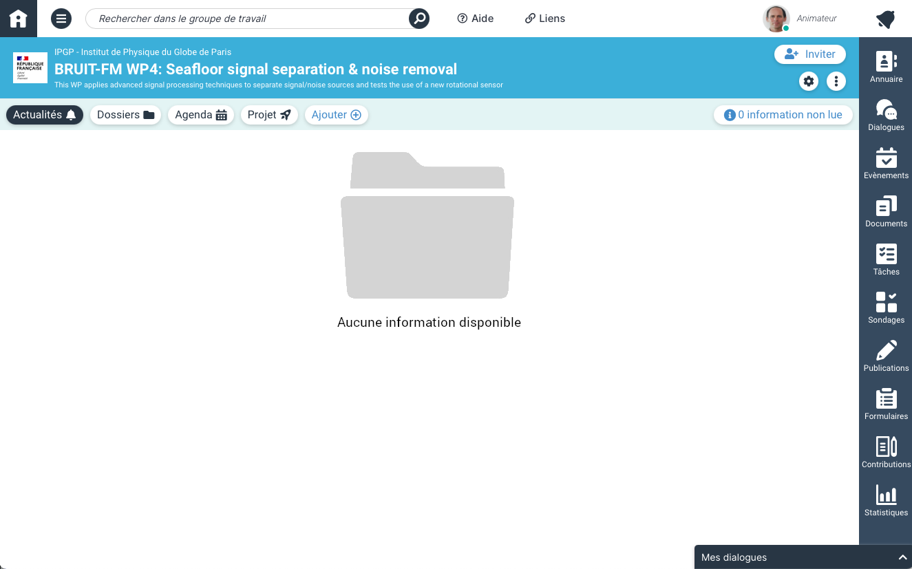

# Project Management

The project management pages are where you should put shared files, collaborate on documents/spreadsheets/presentations and send out
news/updates to everyone or your work package.

## Existing pages:

- [BRUIT-FM project](https://resana.numerique.gouv.fr/public/perimetre/consulter/121414)
    - [WP3: The Generation of Global Seismological Noise](https://resana.numerique.gouv.fr/public/perimetre/consulter/132788)
    - [WP4: Seafloor Signal Separation and Noise Removal](https://resana.numerique.gouv.fr/public/perimetre/consulter/132795)
        - [T4.1: Reducing horizontal noise using a rotational seismometer](https://resana.numerique.gouv.fr/public/perimetre/consulter/132782)
    - [WP5: Seafloor Soundscape](https://resana.numerique.gouv.fr/public/perimetre/consulter/121579)

## Intro to the platform

We are using the French governments "RESANA" platform, here is an example of the Homepage for WP4:

**The tabs at the top** let you:

- : see recently added items (news, documents, actions...)
- : look at, add and edit shared files
- : look at dates and deadlines in calendar format
- : Add/display action items.  You can view them under this tab in
  [Kanban](https://en.wikipedia.org/wiki/Kanban_(development)) or [GANTT](https://en.wikipedia.org/wiki/Gantt_chart) format and they
  will also be displayed in the **Agenda**
- : Add stuff:
    - : Invite new collaborators
    - : Add a news item
    - : Create a co-editable document (isDoc), spreadsheet (isTab) or presentation (isSlide).
      Once you click on one, it will give the option to create a Microsoft or OpenOffice file.
    - : Add an RSS flux (can someone explain this to me?)

**The menu on the right** assembles information from all of your RESANA "projects"

There's a **videoconference tool** as well, but I haven't figured it out.
